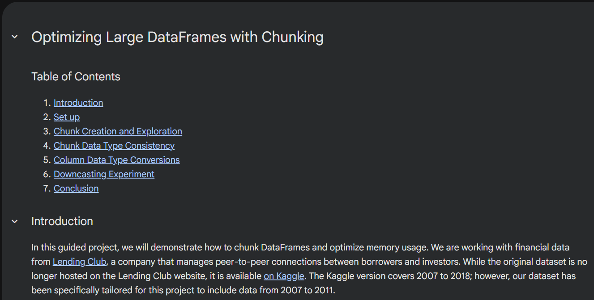

# Optimizing Large DataFrames with Chunking

In this guided project, we will demonstrate how to chunk DataFrames and optimize memory usage. We are working with financial data from [Lending Club](https://www.lendingclub.com/), a company that manages peer-to-peer connections between borrowers and investors. While the original dataset is no longer hosted on the Lending Club website, it is available [on Kaggle](https://www.kaggle.com/datasets/wordsforthewise/lending-club/data). The Kaggle version covers 2007 to 2018; however, our dataset has been specifically tailored for this project to include data from 2007 to 2011.

To simulate a constrained environment, we will operate under the assumption that we only have **10 MB** of available memory. This constraint allows us to establish a clear "benchmark" for chunking our DataFrames effectively.

View this project live on Google Colab [here](https://colab.research.google.com/drive/1-LSfnDKGJBBh6mYwEaNPdOfbZk7YorT-?usp=sharing)
